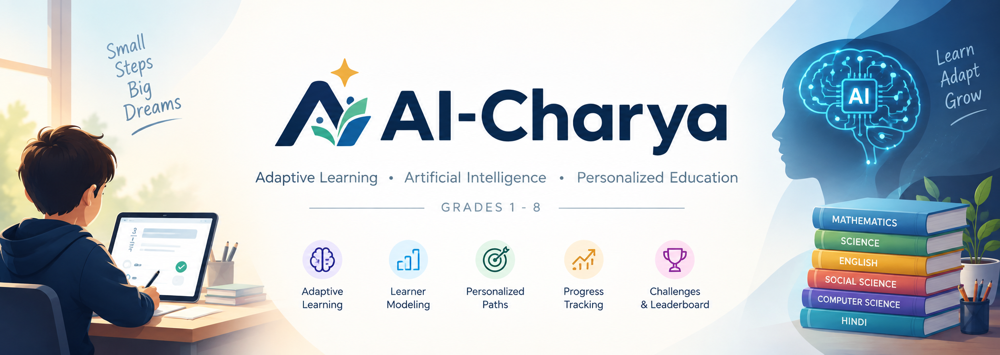
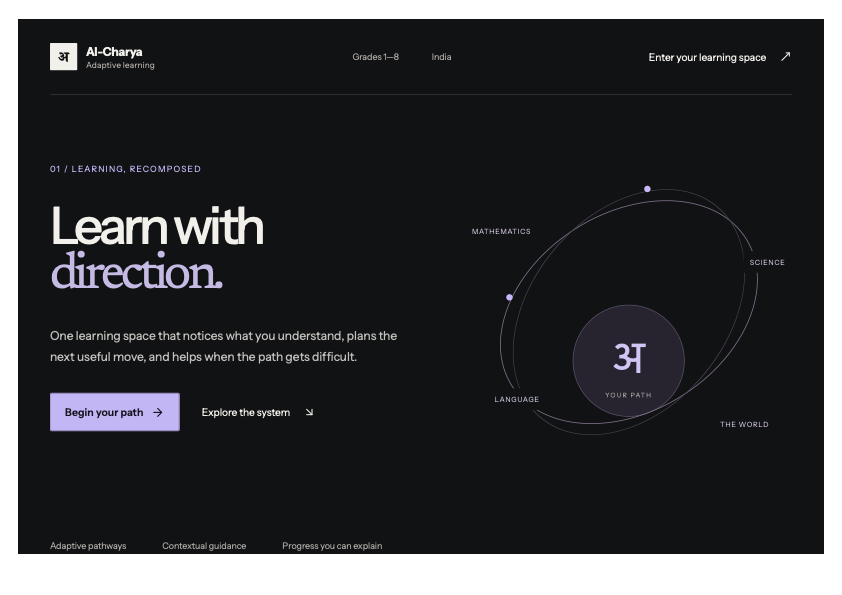
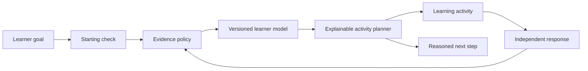

<p align="center">
  
</p>

<h1 align="center">AI-Charya 🎓</h1>

<p align="center">
  <strong>Adaptive learning with direction, evidence, and explainable next steps.</strong>
</p>

<p align="center">
  <a href="https://github.com/ShuklaAshutosh1/AI--Charya">Repository</a> ·
  <a href="https://github.com/ShuklaAshutosh1/AI--Charya/issues">Issues</a>
</p>

---

## 🖥️ Product preview

<p align="center">
  
</p>

## 🌱 About the project

AI-Charya is a learner-first adaptive learning platform for Grades 1–8. It estimates knowledge at the skill level, chooses the next learning activity with an explicit planner, and records why that activity was selected. The learner model, evidence policy, and content planner are separate parts of the system so their decisions can be reviewed and tested independently.

## ✨ What’s implemented

- 🧭 **Adaptive pathways** that select the next activity from goals, prerequisites, evidence, and learner state
- 🧠 **Versioned Bayesian Knowledge Tracing (BKT)** with recorded priors, observations, parameters, and updates
- 🧾 **Evidence policy** that distinguishes independent assessment from responses given after assistance
- 💬 **Bounded learning companion** for hints and explanations that cannot directly change mastery
- 📝 **Starting checks, practice, and checkpoint assessments** with separate evidence behavior
- 📊 **Learner progress** across skill states, evidence, accuracy, XP, streaks, and achievements
- 🏆 **Practice challenges** with deterministic 1v1 and Rapid Fire modes
- 🔐 **Token-protected learner and session APIs** with per-learner authorization
- 💾 **SQLite persistence** for learner profiles, preferences, sessions, evidence, and progress
- ♿ **Learner preferences** including reduced motion and larger text

## 🔄 Adaptive learning loop



The learner model estimates knowledge; it does not select content. The planner selects activities and records its reason. The companion can support a learner but cannot write mastery. Engagement and challenge activity do not feed the learner model.

## 📚 Learning coverage

The platform includes foundation pathways across **Mathematics, Science, English, Social Science, Computer Science, and Hindi**. Each area currently has a populated adaptive foundation path; Grade 6 fractions is the deepest developed mathematics domain. The catalog distinguishes available content from future roadmap topics.

The model and planner are intentionally versioned and provisional. Their parameters and thresholds still require calibration, expert curriculum review, fairness evaluation, and longitudinal outcome validation before any learning-effect claims should be made.

## 🧱 Architecture

| Layer | Implementation |
| --- | --- |
| Frontend | React, TypeScript, Vite, React Router |
| Server | Node.js 22+, Express |
| Storage | SQLite via Node's built-in `node:sqlite` |
| Domain | Separate evidence policy, BKT model, learner state, and planner modules |
| Validation | Vitest unit and service tests; browser verification script |

```text
src/
  content/       Learning catalog, grade maps, and subject content
  domain/        Learner model, evidence policy, and adaptive planner
  pages/         Landing, onboarding, learning, progress, and challenge views
  product/       Learning-area configuration
  server/        Express API, learning services, and SQLite storage
docs/
  adaptive-learning.md  Model assumptions, decision policy, and validation limits
```

## 🚀 Run locally

**Requirements:** Node.js 22 or newer and pnpm.

```bash
pnpm install --frozen-lockfile
pnpm run build
pnpm start
```

Open `http://127.0.0.1:4173`. The server creates its SQLite database under `data/` on first run. For the Vite development server and API workflow, see `vite.config.ts` and the `dev` script in `package.json`.

Run the automated checks with:

```bash
pnpm test
```

## 🔌 API overview

The API is mounted under `/api`. Public routes include `/health`, `/catalog`, learner creation, and the engagement leaderboard. Learner, session, and challenge routes use bearer access tokens and verify resource ownership before returning or updating private data. See `server/api.ts` for the route contract.

## 🔐 Privacy and safety boundaries

- Learner and session access tokens are returned at creation and are not stored in plaintext in SQLite.
- Assistance is recorded separately and assisted answers do not update mastery.
- Challenge results and engagement data do not influence adaptive learner state.
- The BKT settings and planner thresholds are provisional engineering defaults, not validated educational measurements.
- Use synthetic profiles for public screenshots and demos; do not commit real learner information or database files.

## 📄 License

No license file is currently included. All rights remain with the repository owner until a license is added.
